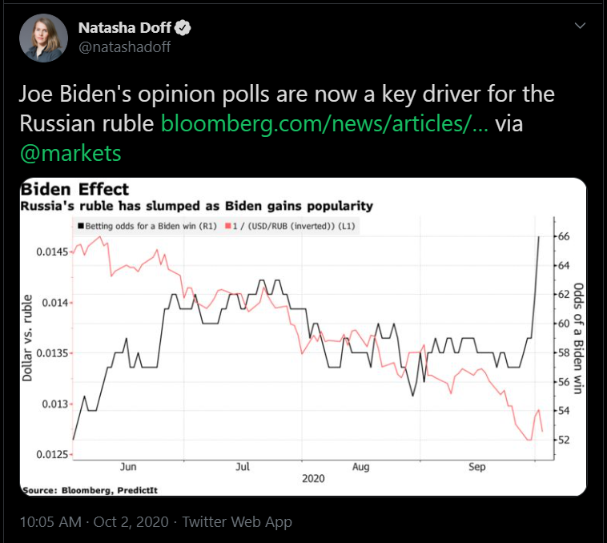
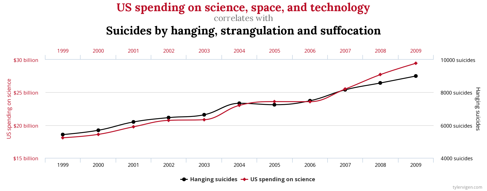
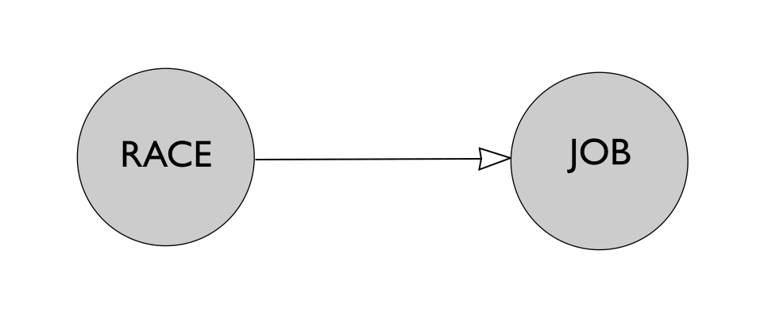

<div class="header" style="margin-top:0 px;font-size:60%;">ITASUR: Third Meeting</div>

Introduction to applied statistics using R
========================================================
author: David Sichinava, Ph.D.
date: October 7, 2020
autosize: true
transition: none
css: css/style.css
font-family: 'BPG_upper'
<span style="font-weight:bold; font-family:BPG_upper;">Third Meeting</span>


Today's meeting
========================================================
- Causality
  - Causal effects
  - Counterfactuals | Potential outcomes model
  - Randomized Controlled Experiments (RCTs)

Today's meeting
========================================================
- Causality
  - Causal effects
  - Counterfactuals | Potential outcomes model
  - Randomized Controlled Experiments (RCTs)

Anything wrong with this tweet?
========================================================


With this?
========================================================


Causality
========================================================
- The reality is that often we ask _causal_ questions, that is, _what causes what_ but in fact, we only have _observational data_

Examples of causal questions:

- Did the 2012 Prison Videos flip elections in Georgia?
- Did the Samtskhe-Javakheti Highway improve economic prospects of rural families in Georgia?

How do we answer these questions?
========================================================
- We have to observe two conditions: one that has a particular _treatment_ and another without one.
- How realistic is that in reality?

Bertrand & Mullainathan (2004)
========================================================
* Set working directory;
* Open a new notebook document;

Bertrand & Mullainathan (2004)
========================================================
_Are Emily and Greg more employable than Lakisha and Jamal? A field experiment on labor market discrimination_. American Economic Review, vol. 94, no. 4, pp. 991–1013.

Bertrand & Mullainathan (2004)
========================================================
* Does the U.S. job market discriminate against black people?


Bertrand & Mullainathan (2004)
========================================================

Procedure:
* Collect all job ads in Boston and Chicago between 2001 and 2002;
* Randomly assign fictitious resumes with _stereotypically_ white and black first names to jobs;
* Send applications;
* Record callbacks from advertisers

Bertrand & Mullainathan (2004)
========================================================
| variable    | Description                                |
|-----------|---------------------------------------|
| firstname | Jobseeker's name                     |
| sex       | Gender                                 |
| race      | Race                                  |
| call      | Callback? |


Bertrand & Mullainathan (2004)
========================================================

```r
resume <- read.csv("resume.csv")
```

Bertrand & Mullainathan (2004)
========================================================

```r
head(resume)

names(resume)
```

Bertrand & Mullainathan (2004)
========================================================

```r
prop.table(table(resume$race), 1)
prop.table(table(resume$race), 2)
```

Bertrand & Mullainathan (2004)
========================================================

```r
mean(resume$call[resume$race == "black"])
```

Bertrand & Mullainathan (2004)
========================================================
Results:
- White candidates received ~50% more callbacks than black candidates;

Quantifying causal effect
========================================================
- Considering this, we might _theorize_ what might have _causal effect_ on a variable of interest.
- Although, how do we quantify _causal effect_?


Neyman-Rubin-Holland Model of Causal Inference
========================================================
- For every $i$, The $T{i}$ treatment effect could be defined, as $Y_{i}(1) - Y_{i}(0)$, where $Y_{i}(1)$ is the outcome in the treatment group, while $Y_{i}(0)$ represents the outcome in the control group
- Fundamental problem of causal inference

Neyman-Rubin-Holland Model of Causal Inference
========================================================


Neyman-Rubin-Holland Model of Causal Inference
========================================================
Quantum mechanics (and so called Copenhagen Interpretation aside), we cannot observe the cat in the opposite state (that is, if the visible outcome is alive, it is impossible to see the cat simultaneously dead)

Fundamental problem of causal inference
========================================================
>> We only observe one potential outcome at a time.

Potential outcomes model
========================================================
- The key goal of causal inference is to predict _counterfactuals_, that is, unobserved outcomes.
- Since it is impossible to observe individual level outcomes, causal inference estimates group-level that is, average outcomes of a particular experiment.

The role of randomization
========================================================
* Randomization creates homogeneous groups, therefore the difference between the two groups could be attributed to the treatment
* As we _manipulate_ treatment, we can therefore speak about _causation_ by design (no causation without manipulation)
* It eliminates selection bias
* Rule of Large Numbers
* Hawthorne effect

Randomized Controlled Experiments (RCTs)
========================================================

$Y_{i}(1) - Y_{i}(0)$

Sample Average Treatment Effect (SATE): a _sample average_ of individual-level causal effects

$SATE = \frac{1}{n}\sum_{n}^{i=1}\left \{ Y_{i}(1) - Y_{i}(0) \right \}$

Randomized Controlled Experiments (RCTs)
========================================================
- Can we really observe SATE?
- Not really, that's why we use __difference-in-means_ estimator
$\hat{\tau} = \frac{1}{n_{1}}\sum_{i=1}^{n}T_{i}Y_{i} - \frac{1}{n_{0}}\sum_{i=1}^{n}(1-T_{i})Y_{i}$

Challenges (Imai, 2012)
========================================================

* RCTs could be hard to analyze
* Violation of the protocol
	+ Contamination;
	+ Non-compliance;
	+ Missing values;
	+ Measurement error;

Challenges (Imai, 2012)
========================================================
* Experimental effect
	+ Heterogeneity
	+ Failure of correctly understanding the causal effect
* Generalization of the results
	+ Internal vs. external validity
	
Sum up: observation vs. experimentation
========================================================
* In social sciences, it is quite hard to design effective experiments;
* Many research questions refer to phenomena that are impossible or unethical to randomize
* Can we answer causal questions with observational data?
  - YES! Through so-called quasi-experiments, that is, situations that resemble random assignment.

Readings for the next class:
========================================================
* Holland, 1986: sections 1, 5, and 9.
* The QSS book: pages 32-68.

_Your assignment will have some questions from your reading_

	
