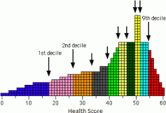

<div class="header" style="margin-top:0 px;font-size:60%;">ITASUR: Fourth Meeting</div>

Introduction to applied statistics using R
========================================================
author: David Sichinava, Ph.D.
date: October 21, 2020
autosize: true
transition: none
css: css/style.css
font-family: 'BPG_upper'
<span style="font-weight:bold; font-family:BPG_upper;">Fourth Meeting</span>


Today's meeting
========================================================

- Causality
	+ Observation
- Confounding bias
- Before-and-after design
- Difference-in-Difference estimate
- Observational studies:
	+ Statistics for one variable
	+ Quantiles
	+ Root of mean squares (RMS)
	+ Standard deviation


Again about causality...
========================================================
* "Cause and effect must be _contiguous_ in space and time..."
* "The same cause always produces the same effect, and the same effect never arises but from the same source..."
<span style="font-weight:bold; font-family:BPG_upper;">David Hume. A Treatise of Human Nature</span>

The role of randomization
========================================================
* Randomization creates homogeneous groups, therefore the difference between the two groups could be attributed to the treatment, and
* eliminates selection bias

Observational studies
========================================================
* However, in many cases we cannot randomly administer treatment on research participants
* In these cases, we rely on _observational_ data
	+ Pros: high external validity
	+ Cons: low internal validity, that is, we may fail to properly explain the underlying causal mechanism.

Card & Krueger (1994): Context
========================================================
* In 1992, New Jersey decided to raise minimum wage from $4.25 to $5.05
* Classic economic theory predicts that these circumstances reduce full-time employment as employers have less incentive to have full-time employers and pay them more.

Card & Krueger (1994): Challenges
========================================================
* What would be an ideal design to look at causal mechanism?
* What should we use as an alternative?


Card & Krueger (1994): Quasi-experimental designs
========================================================
*To identify causal mechanism, we need another New Jersey where minimum wage stayed at pre-1992 level.
* However, as this is impossible, Card and Krueger used Pennsylvania as a reference (_control_).

Card & Krueger (1994)
========================================================
- "Treatment group": fast food restaurants in New Jersey (NJ)
- "Control group": fast food restaurants in Pennsylvania (PA)

Card & Krueger (1994)
========================================================
- Treatment intervention: increase of minimum wage.


Card & Krueger (1994)
========================================================


Card & Krueger (1994)
========================================================

```r
minwage <- read.csv("minwage.csv")
```

Card & Krueger (1994)
========================================================

```r
dim(minwage) ### Dimensions of the table

summary(minwage) ### Descriptive statistics
```
Card & Krueger (1994)
========================================================

| variable    | Description                                |
|-----------|---------------------------------------|
| chain | name of the fast-food restaurant chain                     |
| location       | location of the restaurants (centralNJ, northNJ, PA, shoreNJ, southNJ)                                 |
| wageBefore      | wage before the minimum-wage increase                                  |
| wageAfter      | wage after the minimum-wage increase? |
| fullBefore | number of full-time employees before the minimum-wage increase           |
| fullAfter       | number of full-time employees after the minimum-wage increase |
| partBefore      | number of part-time employees before the minimum-wage increase |
| partAfter      | number of part-time employees after the minimum-wage increase |


Card & Krueger (1994):
========================================================
- How do we measure causal effect of minimum wage increase on employment?

Difference-in-means estimator
========================================================
- Essentially, difference-in-means estimate is what we use in RCTs
- We subtract mean of control group to the mean of treatment group.
$\hat{Diff} = \frac{1}{n}\sum_{i=1}^{n}(Y_{New\ Jersey} - Y_{Pennsylvania})$


Card & Krueger (1994)
========================================================

Create treatment variable as variable Location has more detailed breakdown of geographic areas


```r
minwage$treatment <- ifelse(minwage$location=="PA", "PA", "NJ")
```

Card & Krueger (1994)
========================================================

Our variable of interest is the proportion of full time workers in the workforce


```r
minwage$after_prop <- minwage$fullAfter/(minwage$fullAfter+minwage$partAfter)
```

Card & Krueger (1994)
========================================================
Now let's calculate difference-in-means estimator. How did the increase of minimum wage influence the proportion of full-time employees?


```r
difference_in_means <- mean(minwage$after_prop[minwage$treatment == "NJ"])- mean(minwage$after_prop[minwage$treatment == "PA"])

difference_in_means
```

What is missing from the above analysis?
========================================================

What is missing from the above analysis?
========================================================
* There might exist something that might affect both treatment and control conditions.
  + e.g., macroeconomic conditions of the country, federal level regulations that affect both New Jersey and Pennsylvania, or maybe there are more Burger Kings in Pennsylvania than in New Jersey?
* In other words, we need to account for _confounding bias_

Confounding bias
========================================================
* Confounding bias can be eliminated through statistical control, e.g. through subclassification

Subclassification
========================================================
Let's check how did the introduction of minimum wage regulation affect specific chains (for instance, Burger King)


```r
difference_in_means_bk <- mean(minwage$after_prop[minwage$treatment == "NJ" & minwage$chain=="burgerking"])- mean(minwage$after_prop[minwage$treatment == "PA"& minwage$chain=="burgerking"])

difference_in_means_bk
```

Time-series data
========================================================
* Usually, things change over time due to factors that have less to do with the units of observation but due to some global fluctuations (e.g., macroeconomic instability, national regulations, etc.) 
* Therefore, especially in observational studies it is important to get rid of this type confounding bias.
* That said, difference-in-means estimators are relatively biased and only tell half of the story.

Difference-in-differences estimator
========================================================


Difference-in-differences estimator
========================================================
* Difference-in-differences estimator tells us how the outcome changed relative to pre-treatment period
* In our case, difference-in-differences estimator would account for changes that might occur before and after in BOTH Pennsylvania and New Jersey

Difference-in-differences estimator
========================================================
As the result, we estimate Sample Average Treatment Effect for the Treated (SATT):


Difference-in-differences estimator
========================================================
Let's first calculate proportions before the introduction of minimum wage


```r
minwage$before_prop <- minwage$fullBefore/(minwage$fullBefore+minwage$partBefore)
```

Difference-in-differences estimator
========================================================
Next, estimate shifts changes in treatment and control


```r
diff_nj <- mean(minwage$after_prop[minwage$treatment == "NJ"])-mean(minwage$before_prop[minwage$treatment == "NJ"])
diff_pa <- mean(minwage$after_prop[minwage$treatment == "PA"])-mean(minwage$before_prop[minwage$treatment == "PA"])
```

Difference-in-differences estimator
========================================================
And SATT:


```r
diff_nj-diff_pa
```

How did the minimum wage change affect employment in New Jersey?

Difference-in-differences (DiD) estimator: drawbacks
========================================================
Despite being a versatile method for estimating causal effects in observational studies, DiD has its drawbacks:
* DiD cannot be used in cases when the counterfactual trend in treatment group is not parallel to the observed trend for the control group.
* Impossible to use when the allocation of the intervention is determined by the baseline outcome, when the outcomes are not stable

Descriptive statistics of a single variable:
========================================================
* Magnitude of variable:
  + Quantiles
  + Median
  + IQR (interquantile range)


Median
========================================================


Median
========================================================
Difference-in-differences can be calculated for median values too


```r
diff_nj <- median(minwage$after_prop[minwage$treatment == "NJ"])-median(minwage$before_prop[minwage$treatment == "NJ"])
diff_pa <- median(minwage$after_prop[minwage$treatment == "PA"])-median(minwage$before_prop[minwage$treatment == "PA"])
diff_nj-diff_pa
```


Quantiles
========================================================
* Quantiles help us understand what does the distribution of our variable look like.



Quantiles
========================================================

```r
quantile(minwage$after_prop[minwage$treatment == "NJ"], probs=seq(from=0, to=1, by=0.1)) # Ten groups
quantile(minwage$after_prop[minwage$treatment == "NJ"], probs=seq(from=0, to=1, by=0.25)) # four groups
quantile(minwage$after_prop[minwage$treatment == "NJ"], probs=seq(from=0, to=1, by=0.5)) # median

IQR(minwage$after_prop[minwage$treatment="NJ"]) # Interquartile range
```


Standard deviation
========================================================
Standard deviation is commonly used measure to look at the spread of distribution

Website: https://www.geogebra.org/m/xrVYEV8E

Standard deviation
========================================================


Standard deviation
========================================================


