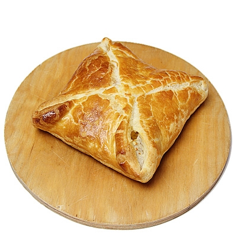

<div class="header" style="margin-top:0 px;font-size:60%;">ITASUR: Seventh meeting</div>

Introduction to applied statistics using R
========================================================
author: David Sichinava
date: December 2, 2022
autosize: true
transition: none
css: css/style.css
font-family: 'BPG_upper'
<span style="font-weight:bold; font-family:BPG_upper;">Seventh meeting</span>


Today's meeting:
========================================================
* (A short) introduction to data visualization;
* Layered grammar of data visualization;
* `ggplot2` library


Before we start:
========================================================

```r
library(ggplot2)
data(mtcars)
```


(Short intro) to data visualization: Ed Tufte's five Commandments
========================================================
* Show the data,
* Increase ink-to-data ratio,
* Remove unnecessary ink which does not come from data,
* Remove unnecessary ink which comes from data,
* Editing is crucial!

Layered grammar of data visualization
========================================================

<span style="width: 100%;text-align: center; font-size:10px">Source: [menu.ge](https://www.menu.ge/restaurant/baraka/fenovani-khachapuri_24049.html)</span>


Layered grammar of data visualization (Wilkinson, 2005; Wickham, 2008)
========================================================
* Data and aesthetic;
* Objects ("geoms");
* Statistical tranformation ("stats");
* Scaling;
* Facets

Layered grammar of data visualization: `ggplot2`
========================================================

```r
p <- ggplot(mtcars)

summary(p)
```

Layered grammar of data visualization: `ggplot2`
========================================================
* `ggplot2` treats charts as _objects_ (as everything in $R$);
* Aesthetics are mapped through `aes()` function;
* Aesthetics show which _variables_ should be used in order to build the chart


Layered grammar of data visualization: `ggplot2`
========================================================

```r
p <- ggplot(mtcars, aes(x=mpg, y=wt))

p + geom_point()
```

Layered grammar of data visualization: `ggplot2`
========================================================

```r
p + geom_point(aes(colour = factor(cyl)))
```
Layered grammar of data visualization: `tidy` data (Codd, 1990; Wickham, 2010)
========================================================
* Each variable is given in a separate column,
* Each case is given in a separate row,
* Each type of record is given ina a table,


<span style="width: 100%;text-align: center; font-size:10px">Source: Wickham, 2010</span>

Layered grammar of data visualization: `tidy` data (Codd, 1990; Wickham, 2010)
========================================================

<span style="width: 100%;text-align: center; font-size:10px">Source: Wickham, 2010</span>

Layered grammar of data visualization: aesthetics
========================================================
* `position`: position,
* `color`: outer color,
* `fill`: internal color,
* `shape`: type of the marker,
* `linetype`: line type,
* `size`: size

Layered grammar of data visualization: aesthetics
========================================================

```r
ggplot(diamonds, aes(x=carat, y=price, color=cut)) + geom_point()
```

Layered grammar of data visualization: aesthetics
========================================================

```r
ggplot(diamonds) + geom_point(aes(x=carat, y=price, color=cut))
```


Layered grammar of data visualization: aesthetics
========================================================

```r
ggplot(diamonds, aes(x=carat, y=price)) + geom_point(aes(color=cut)) + geom_smooth()
```

Layered grammar of data visualization: aesthetics
========================================================

```r
ggplot(diamonds, aes(x=carat, y=price)) + geom_point(aes(shape=cut)) + geom_smooth()
```

Layered grammar of data visualization: Labels
========================================================

```r
gg <- ggplot(diamonds, aes(x=carat, y=price, color=cut)) + geom_point() + labs(title="Satterplot", x="Carat", y="Price")

print(gg)
```

Layered grammar of data visualization: themes
========================================================

```r
gg1 <- gg + theme(plot.title=element_text(size=30, face="bold"), 
                  axis.text.x=element_text(size=15), 
                  axis.text.y=element_text(size=15),
                  axis.title.x=element_text(size=25),
                  axis.title.y=element_text(size=25)) + 
  scale_color_discrete(name="Shape of the Diamond")
print(gg1)  # print the plot
```

Layered grammar of data visualization: facets
========================================================

```r
gg1 + facet_wrap( ~ cut, ncol=3)
```

Layered grammar of data visualization: facets
========================================================

```r
gg1 + facet_wrap( ~ cut, ncol=3)
```

Resources:
========================================================
* `ggplot2` [cheatsheet](https://www.rstudio.com/wp-content/uploads/2015/03/ggplot2-cheatsheet.pdf)
* [ggplot2: Elegant Graphics for Data Analysis](https://www.amazon.com/ggplot2-Elegant-Graphics-Data-Analysis/dp/331924275X/ref=sr_1_1?s=books&ie=UTF8&qid=1506225102&sr=1-1&keywords=ggplot2)
* [webpage](http://ggplot2.tidyverse.org/index.html)
* [Stack Overflow](https://stackoverflow.com/questions/tagged/ggplot2)


Resources used in this presentation:
========================================================
Selva Prabhakaran: [How to make any plot in ggplot2?](http://r-statistics.co/ggplot2-Tutorial-With-R.html)
Ista Zahn: [R graphics workshop @ Harvard](http://tutorials.iq.harvard.edu/R/Rgraphics/Rgraphics.html)
